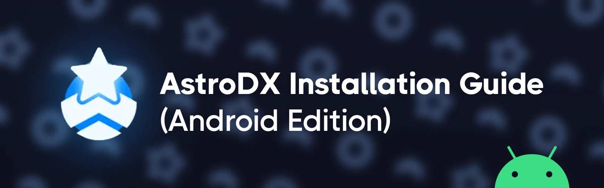

import { Accordion, Accordions } from "fumadocs-ui/components/accordion";
import { File, Folder, Files } from 'fumadocs-ui/components/files';
import { PageCard } from '@/components/PageCard.tsx'

### Introduction

In this guide, you will learn how to play custom levels on Android.
By the end of this guide, you will have installed a level to AstroDX, and AstroDX can display it in the song select menu.

<Callout type="info">

    You can finish this guide on your phone, no computer needed.

</Callout>

<Callout type="warning">

    This guide is written for **AstroDX v2.0.0 Beta 2 Patch 4 and above**.
    If you're using an earlier version of the game, we recommmend you to update.

</Callout>

<iframe
  width="560"
  height="315"
  src="https://www.youtube-nocookie.com/embed/9rr9Ygmyymw?si=tTR3jRaRGG2r56bf"
  title="YouTube video player"
  frameBorder="0"
  allow="accelerometer; autoplay; clipboard-write; encrypted-media; gyroscope; picture-in-picture; web-share"
  referrerPolicy="strict-origin-when-cross-origin"
  allowFullScreen
></iframe>
Check out this
[video](https://www.youtube-nocookie.com/embed/9rr9Ygmyymw?si=tTR3jRaRGG2r56bf)
for a more visual guide to setting up the game.

## Prerequisites

To complete this guide, you will need:

- An Android device with AstroDX installed and **launched at least once**. You can check [Hello, AstroDX!](/) for where to download.
- A custom level **smaller than 2GB** on your device, including at least a track file and a maidata file. You can find some through our [Discord server](https://invite.astrodx.com/).

## Step 1 – Compressing Your File

If your custom level isn't a `.zip` file, compress it into a ZIP Archive.
AstroDX only installs levels from `.zip` files.

For example, if you have a level called "level":

<Files>
  <Folder name="level" defaultOpen>
    <File name="maidata.txt" />
    <File name="track.ogg" />
    <File name="bg.jpg" />
  </Folder>
</Files>

Then you should compress it like this:

<Files>
    <Folder name="level.zip (The name of the zip doesn't matter)" defaultOpen>
        <Folder name="level" defaultOpen>
          <File name="maidata.txt" />
          <File name="track.ogg" />
          <File name="bg.jpg" />
        </Folder>
    </Folder>
</Files>

<Callout type="idea">
    Notice that `level.zip` **contains** the level folder.
</Callout>

You should now have a `.zip` file that AstroDX can work with, but to allow AstroDX to open the file, you need to rename it in the next step.

## Step 2 – Renaming the `.zip`

Rename the `.zip` file into an `.adx` file to let AstroDX know you want to install the file as levels.

If you're on a mobile device, in your file browser, long press on the `.zip` file, and find the **Rename** option to rename the file:

<Files>
    <File name="level.zip (Old)" />
    <File name="level.adx (Rename to this)" />
</Files>

<Callout type="info">
    If you can't rename the file extension, you can also rename the file to `(name).adx.zip`.
</Callout>

Your file is fully prepared. In the next step, we'll install the file into AstroDX.

## Step 3 – Opening the `.adx` File

On your mobile device, tap on the `.adx` file, a menu should pop up prompting you what app you want to open the file with. Select **AstroDX**.

If AstroDX isn't an option, press and hold on the `.adx` file to share the file. In the share menu, select **AstroDX**.

AstroDX should now open up and show you a progress bar.
Once the progress bar finishes, go into the song select menu to view the levels.
You should now have the custom level installed. Yay!

<Callout title="My file manager doesn't have 'Open with' or 'Share'" type="info">

    Try other file managers:

    - [ZArchiver](https://play.google.com/store/apps/details?id=ru.zdevs.zarchiver)
    - [Android SAF](https://play.google.com/store/apps/details?id=com.marc.files)

</Callout>

AstroDX will automatically install levels for you [depending on what the archive contains](https://astrodx.notion.site/ADX-Archive-Details-a8346048819a40b18f0a6c014c19b0b3?pvs=74).

## Conclusion

Now that you've successfully installed a level, you may be interested in learning how AstroDX identifies different `.adx` file layouts.

For example, have you tried putting multiple levels in a single `.adx` file?

<Cards>
    <PageCard slug="install-logic" />
</Cards>

<Callout type="info" title="My god, I do not want to read any of that.">

    Cope, seethe, mald, and ping @davidscann in the AstroDX Discord server.
    **Just make sure to tell me that you’ve decided not to read the guide first.**

</Callout>
