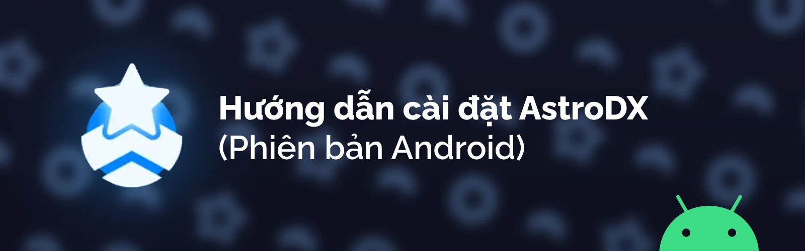

import { Accordion, Accordions } from "fumadocs-ui/components/accordion";
import { Step, Steps } from "fumadocs-ui/components/steps";

<Callout title="Tìm người thông dịch" type="info">
  Nếu bạn muốn góp phần dịch trang web này để nhiều người khác có thể chơi thử game này,
  xin liên hệ @davidscann trong [server Discord AstroDX](https://discord.gg/6fpETgpvjZ) để
  nhận một bản sao và chi tiết thêm nếu cần. Xin cảm ơn!
</Callout>

<iframe
  width="560"
  height="315"
  src="https://www.youtube-nocookie.com/embed/9rr9Ygmyymw?si=tTR3jRaRGG2r56bf"
  title="YouTube video player"
  frameBorder="0"
  allow="accelerometer; autoplay; clipboard-write; encrypted-media; gyroscope; picture-in-picture; web-share"
  referrerPolicy="strict-origin-when-cross-origin"
  allowFullScreen
></iframe>
Bạn có thể xem qua
[video](https://www.youtube-nocookie.com/embed/9rr9Ygmyymw?si=tTR3jRaRGG2r56bf)
này để thấy được quá trình cài đặt game.

# Cài đặt App

Dễ như đếm từ 1 đến 3 vậy.

<Steps>
<Step>
### Tải tệp APK
Bạn sẽ cần đến trang web [AstroDX GitHub Releases](https://github.com/2394425147/maipaddx/releases) để tải tệp APK.
</Step>
<Step>
### Cài đặt

Đa số các thiết bị Android sẽ hiện một thông báo bảo rằng: Vì lý do bảo mật, [trình duyệt của bạn] không được phép cài đặt ứng dụng không xác định.

Nó khá là dễ qua mặt, bạn cứ việc vào phần cài đặt và bật quyền cho trình duyệt mà thôi.

</Step>

<Step>
### Khởi động AstroDX

Sau khi cài đặt game, bạn nên mở ứng dụng ít nhất một lần để khởi động nó.

Điều này sẽ giúp phần cài đặt bài nhạc dễ hơn cho sau này.

</Step>
</Steps>

**Lưu ý: Sẽ không có bài nào cài sẵn!** Không sao cả, **chốc lát** mình sẽ bàn đến vấn đề này.

# Cài đặt bài

<Callout>
  Nếu bạn đang sử dụng một phiên bản cũ hơn của **AstroDX (vd. 2.0 pre-beta)** hay một phiên bản sớm hơn,
  xin vui lòng [truy cập trang này](/install/legacy-android) để có được hướng dẫn. Xin lưu ý răng các phiên bản cũ hơn sẽ không
  được hỗ trợ đầy đủ.
</Callout>

### Bài đâu cả rồi?

Nói trước không thôi quên.

<Cards>
  <Card
    title="Bài tải ở đâu?"
    href="https://discord.com/channels/892807792996536453/1081048213185900584"
  >
    Câu hỏi mà ai cũng đang chờ đợi câu trả lời. Chắc vậy. Không biết nữa.
  </Card>
</Cards>

### **Nhập bài qua tệp nén ADX** **(Khuyên dùng, phiên bản Beta 2 Patch 4 trở lên)**

Đây là cách chính để cài đặt bài mới, và phương pháp này cực kỳ đơn giản.

<Steps>

<Step>
  ### Đặt lại tên tệp zip của bạn
  Bất kỳ tệp `.zip` nào của một hay nhiều bài
  đều có thể **được đổi đuôi lại** thành một tệp `.adx`.
</Step>

<Step>
  ### Mở tệp... > AstroDX
  Trên một thiết bị được hỗ trợ, ấn vào tệp trong trình quản lý tệp bất kỳ, và chọn

  `Mở tệp... > AstroDX.`
</Step>

<Step>
  ### "Lụm tiền"
  AstroDX sẽ tự động cài đặt bài mới cho bạn [tùy vào cấu trúc của tệp](https://astrodx.notion.site/ADX-Archive-Details-a8346048819a40b18f0a6c014c19b0b3?pvs=74).
</Step>

</Steps>

<Callout title="Trên một số thiết bị, ví dụ như Xiaomi hay là một vài thiết bị Samsung, trình quản lý tệp của bạn sẽ không cho bạn lựa chọn mở tệp bằng AstroDX." type="warn">

Với những trường hợp này, xin vui lòng thử một trong hai phương án sau:
[**ZArchiver**](https://play.google.com/store/apps/details?id=ru.zdevs.zarchiver) /
[**Android SAF**](https://play.google.com/store/apps/details?id=com.marc.files)

Đối với những trình quản lý tệp này, nếu bạn không thấy lựa chọn `Mở tệp...`, bạn có thể sử dụng chức năng **Chia sẻ**.
</Callout>

Bạn cũng có thể đặt tên lại bất kỳ tệp `.adx` nào thành tệp `.zip` và giải nén nó như bình thường.

<Callout title="Giới hạn của Android: Tệp .adx không thể lớn hơn 2GB">

Bạn sẽ gặp phải lỗi khi cố gắng cài đặt các tệp .adx lớn hơn 2GB.   Đây là một giới hạn cứng của Android, và chúng tôi **không thể thay đổi được điều này.** 
Chúng tôi sẽ **đề cập đến vấn đề này trong tương lai.**.
</Callout>

### Cài đặt thủ công

Cài đặt bài hát như những phiên bản cũ hơn vẫn đuợc hỗ trợ.

Để cài đặt một bộ sưu tập, bạn sẽ cần phải tạo một tệp manifest. Tìm hiểu thêm tại đây: [wip]

## Cập nhật từ phiên bản cũ

AstroDX sẽ tự động chuyển những bài, bộ sưu tập và điểm của bạn đến phiên bản mới.

Nếu không thành công, một tệp dự phòng sẽ được đặt trong thư mục gốc của AstroDX, và bạn có thể mở một bài hỗ trợ trên kênh diễn đàn[#help](https://discord.com/channels/892807792996536453/1017394299933044847).

# CHTG (Câu Hỏi Thập Gường)

<Accordions>
	<Accordion title="Mình đã để tệp .rar/.zip vào thư mục `/levels` rồi, nhưng vẫn không được!">

Cách đấy, dù sai, vẫn là cách cũ để cài đặt bài mới. Nếu bạn **giải nén** tệp đấy, bạn vẫn có thể cài đặt những bài lẻ, nhưng phương pháp cài đặt bộ sưu tập mới đã được cập nhật mới. Có thể gọi là tốt hơn.

    If you’re using 2.0 Beta 2 Patch 4 or later, you’re probably better off using [the .adx archive method](#installing-levels).
    </Accordion>

    <Accordion title="Is there a way to turn off Notifications? I keep on sliding it down.">

    May thay cho bạn, Android có một chức năng khá giống chức năng Truy cập được hướng dẫn (Guided Access).

    Nó có tên là Ghim ứng dụng (Pin app), và cách bật tùy vào máy bạn là máy nào.

    Trừ khi bạn đang dùng máy hiệu Xiaomi. Có thì thua rồi. Xin lỗi nha.
    </Accordion>

<Accordion title="Mình đã để file mv.mp4 (hoặc là bg.mp4) vào thư mục bài rồi, nhưng vẫn không có video nền!">

    AstroDX tạm thời chỉ hỗ trợ `pv.mp4` cho tên tệp tin video nền. `mv.mp4` là tên file video nền của [Majdata.](https://rentry.org/maiguide).
    </Accordion>

<Accordion title="Có hỗ trợ dung lượng thẻ SD không?">

    Rất tiếc rằng là chưa. Thật ra nó khó một cách bất ngờ để viết phần mềm hỗ trợ thẻ SD.

    Thay vào đó, bạn có thể thử tìm cách tạo Symlink (đường nối) bên trong Android (bởi vì cơ bản nó chỉ là Linux thôi). Mình chưa tìm được cách nào cả. Chúc may mắn nhé!
    </Accordion>

<Accordion title="Sao game này không có trên CH Play? Tại sao lại phải tải file APK?">

    Game này chưa hẳn đạt tiêu chuẩn phát triển ứng dụng trên CH Play, bên cạnh đó game cũng chưa hẳn hoàn chỉnh.

    Dù vậy thì chắc game cũng sẽ ở những web tải app khác thay vì là CH Play vì phí duy trì phần mềm quá cao. Không có miễn phí đâu.
    </Accordion>

<Accordion title="[2.0 Beta] Vì sao mình lại thay đổi cách cài đặt bài mới?">

    Như bạn có thể đã biết, trong những phiên bản cũ của AstroDX, bài mới có thể được cài đặt thẳng vào thư mục `levels` (nếu là bài lẻ) hoặc trong một thư mục mẹ để tạo một **bộ sưu tập**. Việc đấy đã giúp đơn giản hóa việc tùy chỉnh bộ sưu tập qua trình quản lý tệp, nhưng chuyện đấy cũng tạo nên một vài vấn đề thú vị.

    **Bạn không thể dùng chung một bài trong nhiều bộ sưu tập.** Vì bộ sưu tập được quản lý theo nhiều thư mục khác nhau, nó rất khó để tìm đúng một bài nằm trong nhiều thư mục khác nhau. Cho dù có làm được đi nữa, quản lý đường dẫn và tệp phím tắt sẽ rất không hiệu quả trong quá trình xóa hoặc di chuyển tệp sang nơi khác.

    **Nhiều bài khác nhau có thể sẽ có chung một tên.** Mặc dù mình dùng thư mục để nhóm các bài khác nhau, các bài được hiển thị trong một danh sách lớn trong game. Điều này khiến cho việc có 2 hoặc nhiều thư mục với cùng một tên, gây ra vấn đề trong việc xử lý quản lý điểm và bài mới. Thêm một vấn đề nữa, khi bạn đang cài đặt thêm bài mới, chuyện quản lý một tá thư mục có thể sẽ gây ra vấn đề khác.

    Qua phương pháp quản lý bộ sưu tập mới, mặc dù làm việc quản lý chỉnh sửa bộ sưu tập tuy khó hơn một chút, những vấn đề trên đã được đề cập. (Sắp đến sẽ có một chức năng quản lý mới để việc ấy dễ dàng hơn)
</Accordion>
</Accordions>

### **Trời ơi, đọc đọc cái gì mà tốn thời gian quá.**

Khóc, nũng, giận vài ba phát rồi ping @davidscann trong server Discord AstroDX.
**Nhớ bảo mình là bạn quyết định là không muốn đọc cái hướng dẫn này trước.**

 ✨ yêu bạn lắm 💖 

