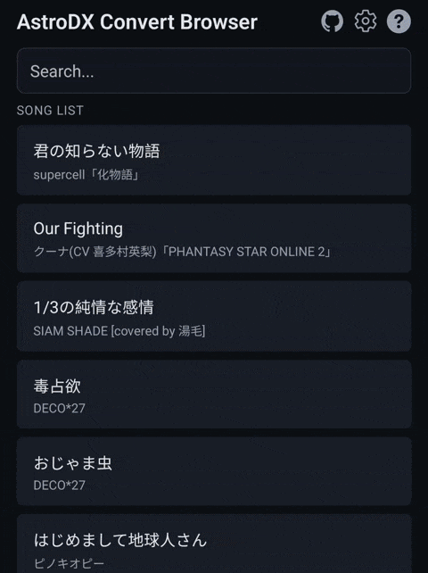
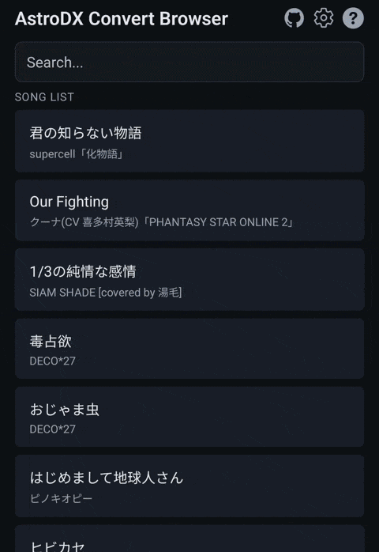
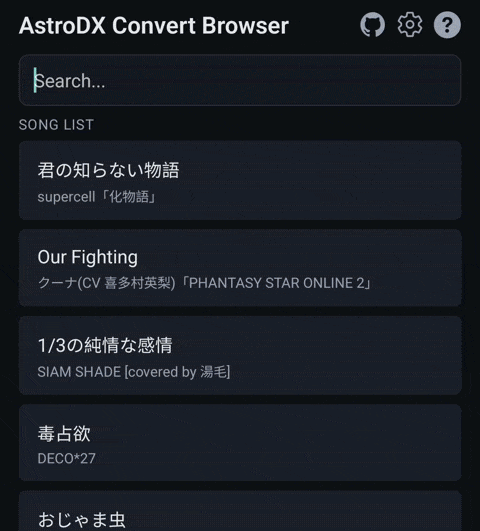
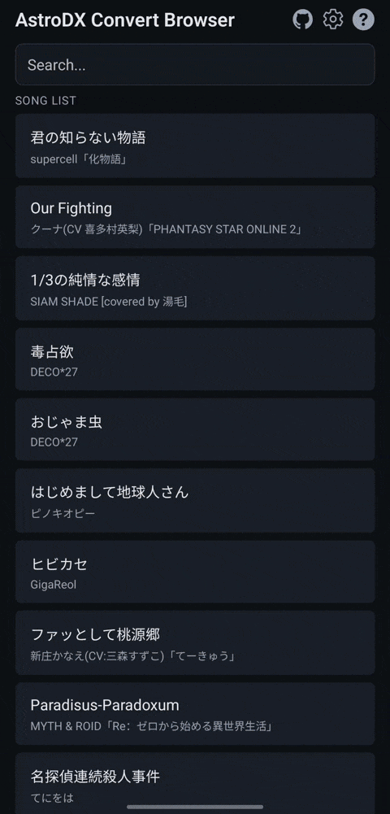
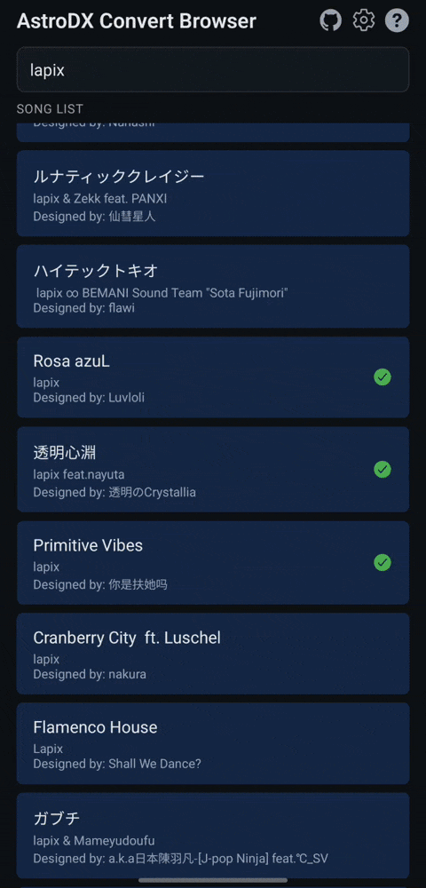
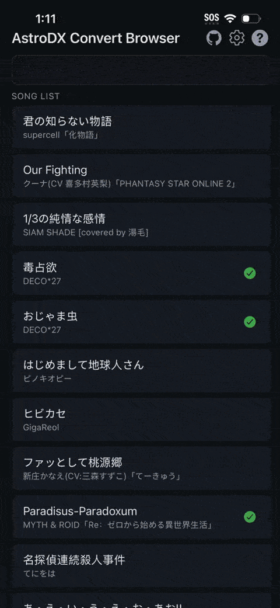

## Introduction

In this guide, you will learn how to play custom levels on **both Android and iOS/iPadOS.**
By the end of this guide, you will have installed a level to AstroDX, and AstroDX can display it in the song select menu.

<Callout type="info">
    You can finish this guide on your phone, no computer needed.
</Callout>

## Prerequisites

To complete this guide, you will need:

- An Android or iOS/iPadOS device with AstroDX installed. You can check [Hello, AstroDX!](/) for where to download.
- The community-made ["AstroDX Convert Browser" app](https://github.com/trustytrojan/adx-convert-browser). It works on both Android and iOS/iPadOS.
  - On Android, you can download the latest APK [here](https://nightly.link/trustytrojan/adx-convert-browser/workflows/build-android/master/android-build.zip).
  - On iOS/iPadOS, you will need to install the [Expo Go](https://apps.apple.com/us/app/expo-go/id982107779) app from the App Store, then scan the QR code visible [here](https://github.com/trustytrojan/adx-convert-browser?tab=readme-ov-file#iosipados). Once scanned, the app will load within Expo Go. It might take a while.

## How to use the app

- Tap any song in the Song List to start downloading it.

- You can add multiple songs to the downloads by tapping on other songs while some are downloading.

- You can search for songs by their title, artist, or chart designer for unofficial (fanmade, not in the official maimai game) charts (which are colored blue).

- You can select multiple songs to download (or import to AstroDX if already downloaded) by holding on a song button.

## Differences between Android and iOS/iPadOS

- When two or more downloads complete on **Android**, the app will zip up all the selected songs for you into one `.adx` file, and then launches an activity to "open" or "view" the `.adx` file. If you haven't associated `.adx` files with the AstroDX app before, make sure you do that in the "Open with" popup, or manually in your device's settings.

- When two or more downloads complete on **iOS/iPadOS**, the app will zip up all the selected songs for you into one `.adx` file (it will be a slow process due to the limitations of Expo Go), and then shows an alert with a "Share" button. You have to tap "Share", then in the share dialog tap "Save to Files", then navigate to the "AstroDX" folder and press "Save".

