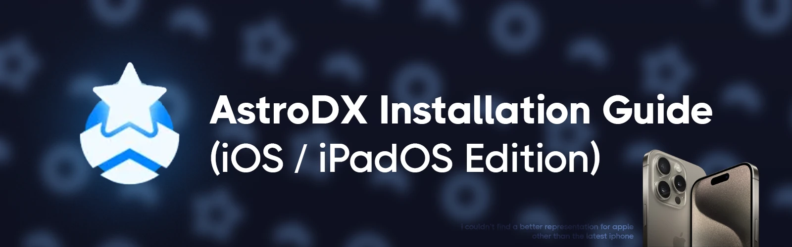

import { Accordion, Accordions } from "fumadocs-ui/components/accordion";
import { Step, Steps } from "fumadocs-ui/components/steps";
import { Card, Cards } from "fumadocs-ui/components/card";



<Callout title="Translators needed!" type="info">
  For those who want to translate this article so more people can enjoy this
  game, please contact @davidscann in the [AstroDX Discord
  server](https://discord.gg/6fpETgpvjZ) for a copy and as well as clarifications if
  needed. Thank you!
</Callout>

# Instalación del App

Esto es como puedes instalar el app.

<Steps>

<Step>
  ### Descargar TestFlight
  Tendras que descargar la [app de TestFlight](https://apps.apple.com/ca/app/testflight/id899247664).
</Step>

<Step>
### Invitación de TestFlight
Usted podra encontrar los links en nuestro [server de Discord](https://sht.moe/astrodx), en el canal [#testflight](https://discord.com/channels/892807792996536453/1210127565986205726).
<Accordions>
<Accordion title="Si eres muy flojo, aquí están.">
	<Cards>
	<Card
	href="https://testflight.apple.com/join/rACTLjPL"
	title="Grupo A"
	>
	</Card>
	<Card
	href="https://testflight.apple.com/join/ocj3yptn"
	title="Grupo B"
	>
	</Card>
	<Card
	href="https://testflight.apple.com/join/CuMxZE2M"
	title="Grupo C"
	>
	</Card>
	<Card
	href="https://testflight.apple.com/join/T6qKfV6f"
	title="Grupo D"
	>
  </Card>
	<Card
	href="https://testflight.apple.com/join/sMm1MCYc"
	title="Grupo E"
	>
	</Card>
	</Cards>

    Pero, estarás perdiendo actualizaciones en vivo de cuando se libera el cupo. Tú decisión. ¯\\\_(ツ)_/¯

</Accordion>
</Accordions>
</Step>
<Step>
### Primer lanzamiento
Después de instalar el juego, se sugiere abrir el juego al menos una vez para initializar el juego.
</Step>
</Steps>

**No va a haber canciones por default!** Eso esta ok, obtendremos canciones **en la siguente sección**.

# Instalando Niveles

### ¿Dónde estan los mapas?

Saquemos esto del camino.

<Cards>
  <Card
    title="¿Dónde descargar mapas?"
    href="https://discord.com/channels/892807792996536453/1081048213185900584"
  >
    Dale click a este botón para ir al canal #chart-download-where
  </Card>
</Cards>

Esto es como puedes poner esos mapas en tu juego:

<Steps>
<Step>
### Navegando a la carpeta
Usando la app de Files, vete a la carpeta `AstroDX/`.
<Callout
title="¿Descargasté los mapas en tu computadora?"
>
Para usuarios de Mac OS, yo asumo que puedas hacer AirDrop los archivos a tu dispositivo.

Yo mismo no tengo una mac, pues no te puedo enseñar como, pero debe ser posible.

    Para usuarios de Windows y Linux, yo recomiendo ir a [esta sección](#localsend--an-open-source-alternative-to-airdrop) donde yo voy en detalle en como transferir archivos eficientemente a i[Pad]OS.
    </Callout>

</Step>
<Step>
### Instalando los mapas
- La actualización nueva de AstroDX ha hecho instalar nuevos mapas mas simple y mas complejo a la misma vez. Veras lo que digo.

**Para el proposito de esta guía, una `colección` es basicamente una carpeta de mapas. Tu estarás familiar con estra estructura.** `24. PRiSM/Chronomia`

<Accordions>
<Accordion
title="Esto es como installas nuevos mapas y colecciones:">
	<Steps>
	<Step>
	Descarga el archivo `.zip` para el mapa/colección que tu quieres.
	</Step>
	<Step>
	Renombra el archivo `.zip` para cambiar su extensión a un archivo `.adx`.

    	<p className="text-sm opacity-50"> Por ejemplo, `24. PRiSM.zip` se convierte `24. PRiSM.adx`. Lo mismo para mapas individual. </p>
    </Step>
    <Step>
    Mueve ese archivo .adx dentro de la carpeta `AstroDX`, localizado en tus archivos.

    **No, no en `levels`.**

</Step>
</Steps>
</Accordion>
</Accordions>
**Eso es todo.** La siguente vez que abras el juego, AstroDX automagicamente ordenará tus niveles por ti, y podrás disfrutar el mapa.
</Step>
</Steps>

Si quieres cambiar como, agregar un mapa a una colección, se hace un poco mas complicado.

<Callout title="¿Quiéres modificar tus colecciones aún mas?">
  **Salta esta sección** (o salte de la guía, porque ya terminaste)
  si no estas interesado en cambiar nada.
</Callout>
Dentro de tu carpeta de `AstroDX`, encontrarás una carpeta `collections` y una carpeta `levels`. -
La carpeta `collections` SOLO almacena información sobre las colecciónes individuales,
localizado en las subcarpetas. - La carpeta `levels` SOLO contiene archivos que son relacionados con
tus mapas.

Si quieres modificar una colección como, agregar un mapa a uno, tendras que ir a la carpeta de esa colección y cambiar información sobre el archivo `manifest.json`.

Lee la información sobre ese archivo [aquí](https://astrodx.notion.site/Collection-Manifest-Details-8f966de6971748e0ac01c0a0a6054594), pero **RPV**:

En el archivo `manifest.json`, tendras este formato. Leer esto te debe dar una idea de como sirve.

```json
{
  "name": "Collection name",
  "id": null, // you can ignore this
  "serverUrl": null, // you can ignore this
  "levelIds": ["Each item here", "is a folder inside", "the levels folder"]
}
```

Exactamente como formateado, asi es como un archivo `manifest.json` sirve.

#### LocalSend – una alternativa libre para AirDrop

Esta sección es basicamente esencial si quieres transferir archivos entre tu PC y tu iPhone o iPad (excepto si es una Mac, en ese caso solo usa AirDrop)

Descarga LocalSend en tu PC y tu dispositivo.

<Cards>
  <Card
    title="App Store"
    href="https://apps.apple.com/us/app/localsend/id1661733229"
  ></Card>
  <Card
    title="Sitio oficial para descarga en PC"
    href="https://localsend.org/"
  ></Card>
</Cards>
Asegura que ambos dispositivos esten en la misma red de WiFi.

Deja la app de LocalSend abierto en tu movil. En tu PC:

<Steps>
  <Step> Abre el menu de mandar. </Step>
  <Step>
    {" "}
    Elige "File", y selecciona el archivo `.adx` que incluye tus mapas.{" "}
  </Step>
  <Step>
    {" "}
    Tu iPhone o iPad debe estar en ese menu, con un nombre codigo. Dale click al nombre.{" "}
  </Step>
  <Step>
    {" "}
    Revisa tu dispositivo. Debe tener una gestion si tu quieres Aceptar
    los archivos. Claramente, Acepta.{" "}
  </Step>
  <Step> Los archivos deben estar dentro de tu app de Archivos, en `LocalSend`. </Step>
  <Step>
    {" "}
    Solo mueve el archivo transferido `.adx` a `AstroDX`, y terminaste!{" "}
  </Step>
</Steps>
Solo metete al juego y disfruta AstroDX.

# PF (Preguntas Frequentes)

<Accordions>
	<Accordion title="He puesto los archivos .rar/.zip dentro de `/levels`, pero aun no sirve!">

    Tendras que extraerlo primero en el caso de niveles solos.

    Pero, probablemente estarás mejor usando [el metodo de archivo .adx](#installing-the-charts).
    </Accordion>

    <Accordion title="¿Hay una forma de desactivar Notificaciones? Lo quedo deslizando.">

    Usa [**Acceso Guiado**](https://www.google.com/search?q=ios+guided+access).

    </Accordion>

    <Accordion
    title="Información relacionado a compatibilidad de archivos"
    >
    No pude describir esto correctamente, pues dejaré esta información aquí.

    Los codecs oficialmente soportados para AstroDX en iOS:
    	- **Video:** H.264
    	- **Audio:** OGG Vorbis (con extensión .ogg) **O**  mp3 (con extensión .mp3)
    </Accordion>

<Accordion title="He puesto el archivo mv.mp4 (o bg.mp4) en la carpeta, pero no se reproduce!">

    AstroDX solo detecta `pv.mp4` para archivos de video. `mv.mp4` es lo que se necesita para correr el video en [Majdata](https://rentry.org/maiguide).
    </Accordion>

<Accordion title="¿Porqué el juego no esta en el App Store?">

    Las razones son dos. Aun no calificamos para implementación en el App Store, y queremos ser un juego enteramente completo antes de que lo hagamos.

    </Accordion>

<Accordion title="¿Pueden mandar un archivo .ipa para que hagamos sideload el juego?">

Deseamos que podamos, pero esta es la razón porque no es posible:

    > Por el momento, sideloading de ipa no esta recomendado. En corto, publicando archivos ipa permite personas distribuir AstroDX como su propia aplicación en el app store, y potencialmente ganar con ello por insertar anuncios o añadiendo restricciones pagadas. Nosotros queremos estar seguros que el juego se publicara a el app store justamente, pues eso es porque no estamos planeando en publicar ningun archivo ipa.

**RPV:** Malas personas es la razón que no es posible.

    </Accordion>

    <Accordion title="¿Porqué el TestFlight esta lleno tan comunmente? ¿Cuándo tendré mi oportunidad de jugar?">
    La respuesta corta es: muchas personas quieren jugar este juego.

    La razón por solo tener una capacidad limitada es que es todo lo que podemos aportar justo ahora. Nos cuesta abrir estos grupos para ustedes, y estamos usando nuestro dinero.
    </Accordion>
    <Accordion title="Si se acaban los cupos tan rápido, ¿porqué no abren mas grupos? ¿Porqué no un Groupo E y un Groupo F y asi?">
    Lee lo anterior.
    </Accordion>

<Accordion title="[2.0 Beta] ¿Porqué estamos cambiando la acomodación del almacenamiento?">

    Como usted talvez puede conocer, en versiones anteriores de AstroDX, niveles se pueden poner entre en el nivel-alto (Directamente dentro de la carpeta `levels`), o usted puede poner uno o mas niveles dentro de otra carpeta nombrada para hacer una **colecciones**. Esto lo hizo muy facil para customizar colecciones directamente en el sistema de archivos, pero tambien introdujo unos problemas interesantes.

    **No puedes utilizar el mismo nivel en multiples colecciones.** Debido a que colecciones existen como carpetas, es muy difícil averiguar una manera para poner el mismo nivel dentro de muchas carpetas a la vez. Aun que sea posible, controlar accesos directos y links aseguradamente será dificil al borrar un nivel o mover un nivel a otro lugar.

    **Multiples niveles pueden tener el mismo nombre.** Aunque usamos carpetas para agrupar niveles, los niveles se expanden a una lista singular en el juego. Esto lo hace posible que dos o mas carpetas del mismo nombre existan, creando una colision de llaves en el diccionario de niveles del juego. Y cuando estas agregando niveles a un mar de carpetas, es difícil identificar cuando una carpeta del mismo nombre ya existe.

    Por usar un metodo alternativo de representar las colecciones, aunque lo hemos hecho un poco mas complejo editar datos de colecciones (que estamos trabajando un administrador de colecciones dentro del juego para resolver), podemos resolver los problemas mencionados anteriormente.

</Accordion>
</Accordions>

### **Por dios, yo no quiero leer nada de eso.**

Quejate, hiervete, y menciona a @davidscann en el server de Discord de AstroDX.
**Solo asegúrate de decirme que tu has decidido no leer la guía.**

<p className="font-serif text-center italic text-xl"> ✨ hecho con amor 💖 </p>
